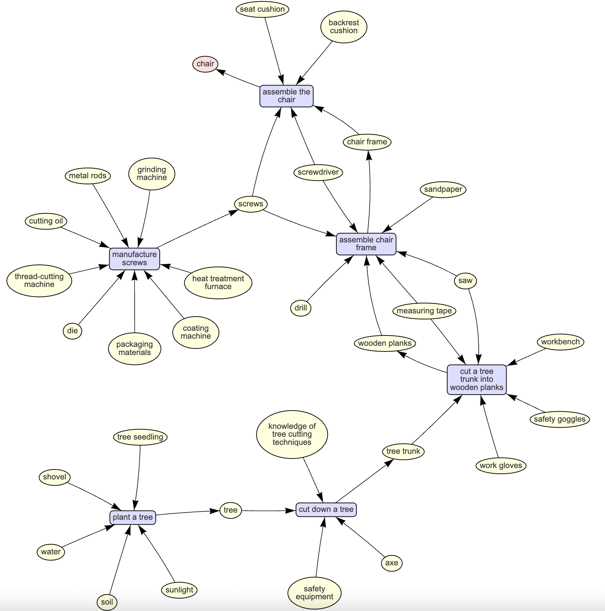

# make-map

Stupid app that visualises how-to instructions for "anything". Built with Flask, vis.js and gpt-3.5-turbo.

## Prerequisites
- OpenAI API key 

## Installation
Clone this repository:

```bash
git clone https://github.com/haztro/make-map.git
```
Install requirements: 

```bash
pip install -r requirements.txt
```

Create a **'.env'** file in the root directory and populate it with your OpenAI API key:

```.env
API_KEY=your_openai_api_key_here
```

## Usage
Run the Flask app:

```bash
python app.py
```

Open your web browser and navigate to http://127.0.0.1:5000/.

The application will display a directed graph. Click on a node to expand it and reveal further instructions and required items.



## License
This project is licensed under the MIT License. See the [LICENSE](https://github.com/haztro/make-map/blob/main/LICENSE) file for details.

